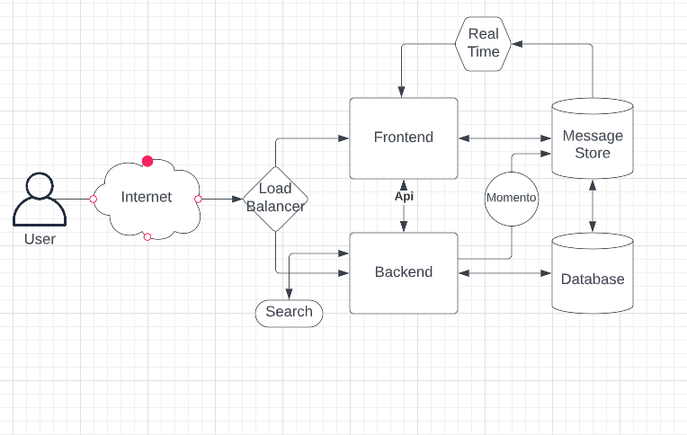
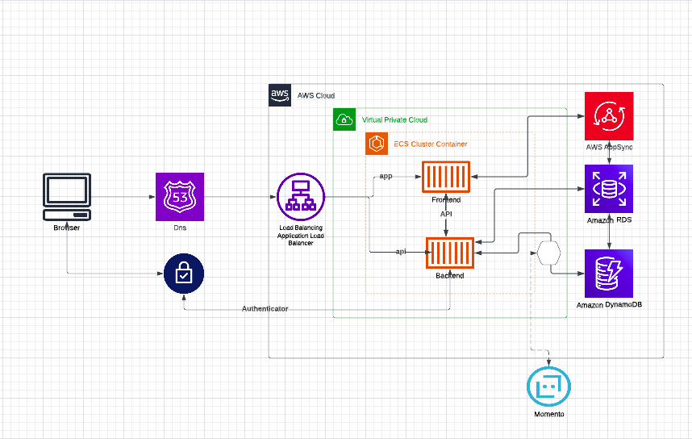
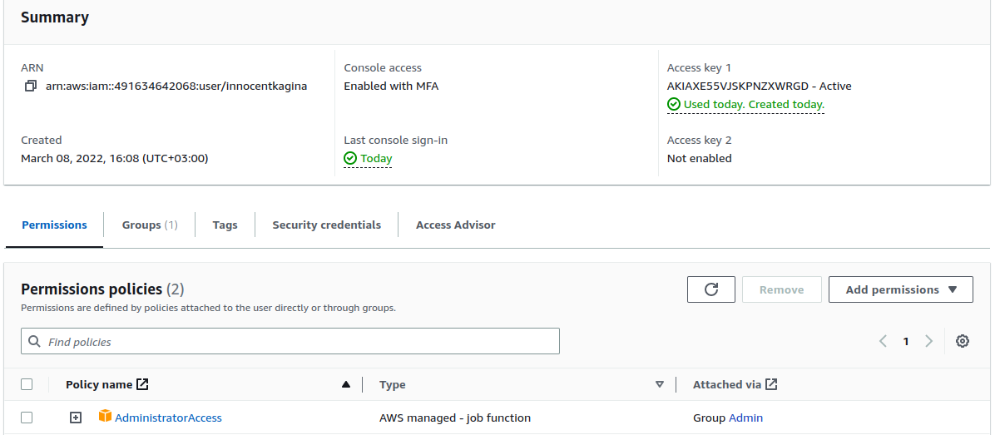
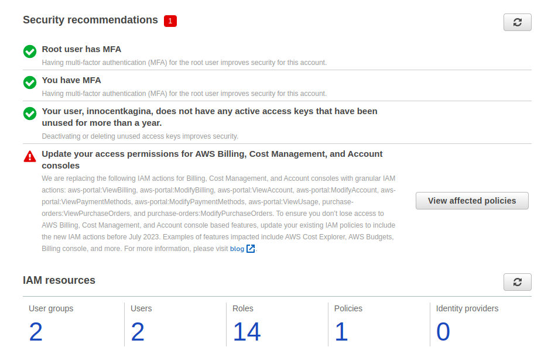
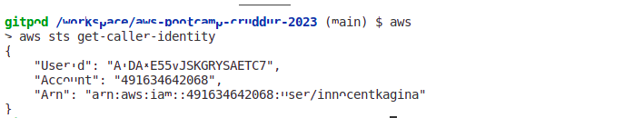
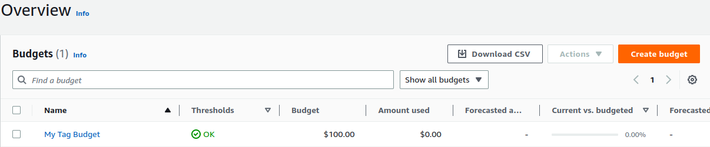
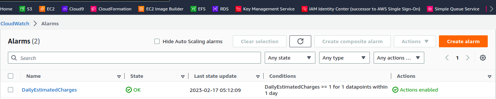
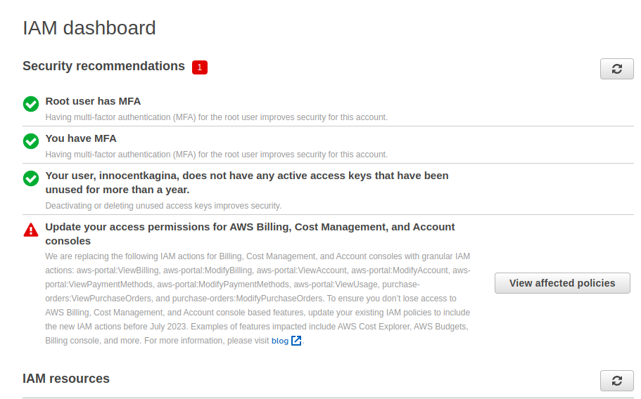
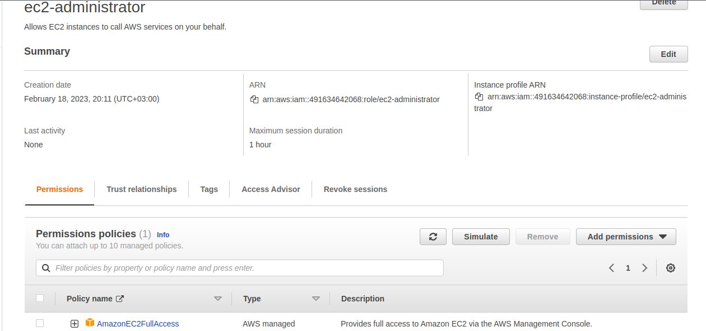

# Week 0 — Billing and Architecture

## Required Homework/Tasks

### Recreate Conceptual Architectural Deisgn



[Lucid Charts Share Link](https://lucid.app/lucidchart/faf54612-690b-4a01-8aad-590283ca0dce/edit?invitationId=inv_73cd73ad-fad8-4b56-8505-aff9df49c307)

### Recreate Logical Architectural Deisgn



[Lucid Charts Share Link](https://lucid.app/lucidchart/77596908-fead-45d9-bdaa-4df3c89b8922/edit?invitationId=inv_5903bea8-9ef7-4f41-8253-a33811f4ca0a)

### Create Admin User & Generate AWS Credentials
I created a new user using AWS console putting in mind best security practices such as enabling Multifactor authentication and also generating an access key to be used by gitpod environment

 
 

### Install and Verify AWS CLI 

I was able to successfully use Gitpod and its features to install AWS CLI.

I followed  instructions on the [AWS CLI Install Documentation Page](https://docs.aws.amazon.com/cli/latest/userguide/getting-started-install.html)

I also managed to set up variables in Gitpod to have avoid exporting AWS variables everytime the Workspace is loaded. ![Image of Gitpod Variables(gp-aws-variables.png) 

I attempted to run the command by typing in `aws` but I recieved an error

```
bash: aws: command not found.
```
I was able to resolve the error by closing command prompt, and opening it again.



### Create a Budget

I created a Budget for $100 using AWS_CLI based a budget-json file as well as notifications file to send alerts incase certain thresholds are exceeded using following code
```
aws budgets create-budget \
    --account-id $AWS_ACCOUNT_ID \
    --budget file://aws/json/budget.json \
    --notifications-with-subscribers file://aws/json/notifications-with-subscribers.json
 ``` 
 

### Create an Alarm
I created an CloudWatch alarm using AWS_CLI based a json file with trigger if charges exceed $1 using following code
```
aws cloudwatch put-metric-alarm --cli-input-json file://aws/json/alarm-config.json
``` 
 

### Destroy your root account credentials, Set MFA, IAM role
I created an administrator account named "innocentkagina" from my Root account and activated MFA  for both Root and Administrator as shown by the image in the journal folder.
 

I created an IAM role named "ec2-administrator" with only EC2 admin full privileges as shown by the image in the journal folder.
 