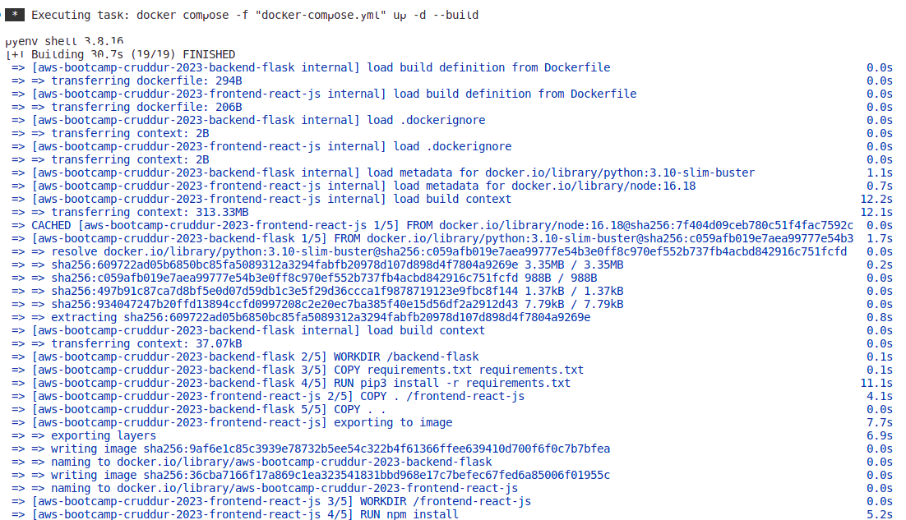
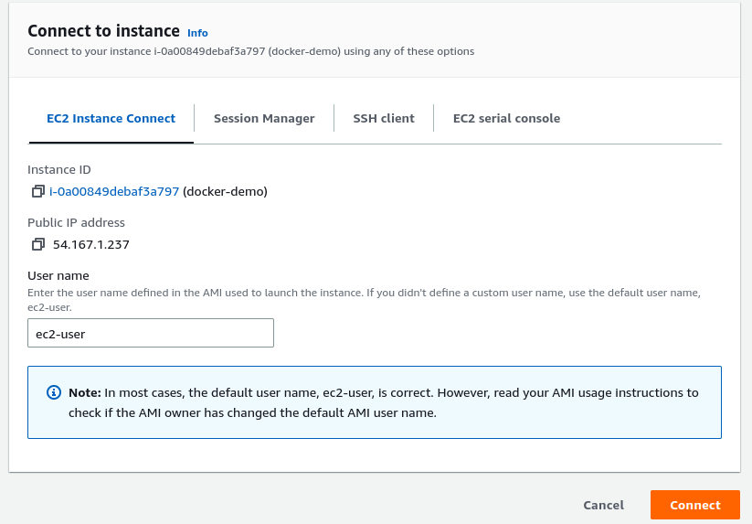
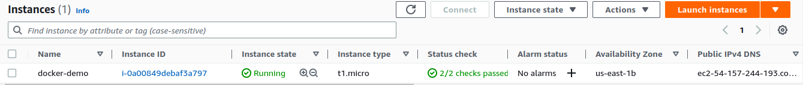
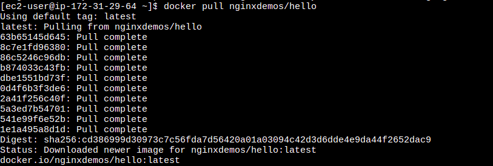
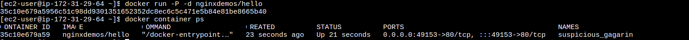
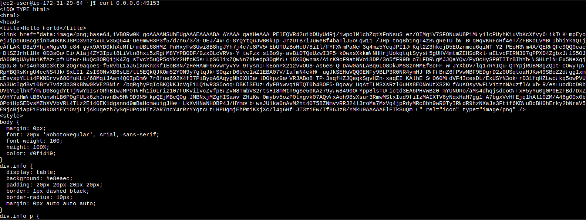
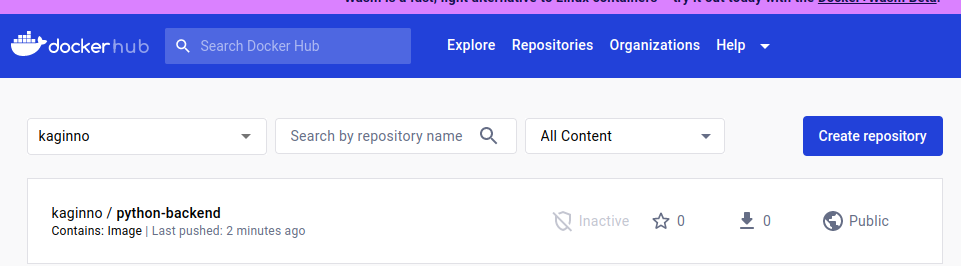
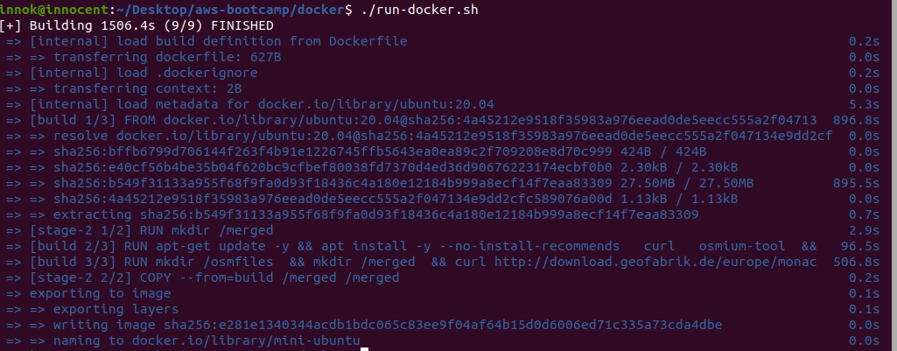

# Week 1 — App Containerization
### Required Work
1-I created a backend end point for notifications page

[backend-flask/app.py]

1a- I created a frontend end point for notifications page

[frontend-react-js/src/pages/NotificationPage.js]


2-I created a Dockerfile for frontend and backend

docker for frontend

[frontend-react-js/Dockerfile]

docker for backend

[backend-flask/Dockerfile]


3-I also built image and ran containers of apps separate

docker run for frontend
```
docker build -t aws-bootcamp-cruddur-2023-frontend /frontend-react-js
docker run --rm -d -p 3000:3000/tcp aws-bootcamp-cruddur-2023-frontend-react-js:latest

```

docker run for frontend
```
docker build -t aws-bootcamp-cruddur-2023-backend /backend-flask
docker run --rm -d  aws-bootcamp-cruddur-2023-backend-flask:latest

```

4-I created a docker- compose file to combine two images created as well as added postgres and dynamoDB service
docker-compose file

[docker-compose.yml]

5-I ran the docker-compose file to ensure both apps run and can talk to each other
```
docker compose -f "docker-compose.yml" up -d --build 
```
 

6-I also added persistent data storage in docker-compose file by adding volumes for backend
```
volumes:
      - ./backend-flask:/backend-flask
```
====================================================================================================================
###HomeWork Assignment

1- Launch an EC2 instance that has docker installed, and pull a container to demonstrate you can run your own docker processes. 
I created a new EC2 instance and connected into it using Aws inbuilt cli
 

installed docker on instance as follows
```
sudo yum install docker -y
sudo usermod -a -G docker ec2-user
newgrp docker
sudo systemctl enable docker.service
sudo systemctl start docker
```
 

Pull an image from dockerhub
```
docker pull nginxdemos/hello
```
 

Run docker nginx image
```
docker run -P -d nginxdemos/hello
```
 

Test server
```
curl  0.0.0.0:49153
```
 

2- Implement a healthcheck in the V3 Docker compose file
Created two Health Checks,one for Backend  and Frontend

Frontend Healthcheck
```
healthcheck:
      test: ["CMD", "curl", "-f", "https://3000-${GITPOD_WORKSPACE_ID}.${GITPOD_WORKSPACE_CLUSTER_HOST}"]
      interval: 60s
      retries: 5
      start_period: 20s
      timeout: 10s
```
Backend Healthcheck
```
healthcheck:
      test: ["CMD", "curl", "-f", "https://4567-${GITPOD_WORKSPACE_ID}.${GITPOD_WORKSPACE_CLUSTER_HOST}"]
      interval: 60s
      retries: 5
      start_period: 20s
      timeout: 10s
```
3- Push and tag a image to DockerHub
I decided to tag the  backend image 
```
docker tag aws-bootcamp-cruddur-2023-backend-flask:latest kaginno/python-backend
```
then pushed it to my private dockerhub registry
```
docker login
docker push kaginno/python-backend

```


4- Use multi-stage building for a Dockerfile build

I create a seperate Dockerfile building from two ubuntu images to make a multistage build

```
FROM ubuntu:20.04 AS final
FROM ubuntu:20.04 as build
# BUNDLE LAYERS
RUN apt-get update -y && apt install -y --no-install-recommends \
  curl \
  osmium-tool \
 && rm -rf /var/lib/apt/lists/*
RUN mkdir /osmfiles \
 && mkdir /merged \
 && curl http://download.geofabrik.de/europe/monaco-latest.osm.pbf -o /osmfiles/monaco.osm.pbf \
 && curl http://download.geofabrik.de/europe/andorra-latest.osm.pbf -o /osmfiles/andorra.osm.pbf \
 && osmium merge /osmfiles/monaco.osm.pbf /osmfiles/andorra.osm.pbf -o /merged/merged.osm.pbf
FROM final
RUN mkdir /merged
COPY --from=build /merged /merged
```

5- Run the dockerfile CMD as an external script
I created a bash script to run the above image build

run-docker.sh
```
#!/bin/bash
docker build -t mini-ubuntu .
```
Make file executable
```
sudo chmod +x run-docker.sh
```
