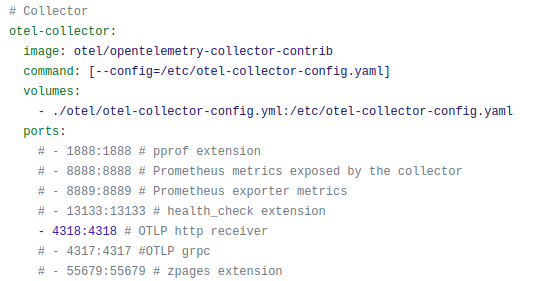
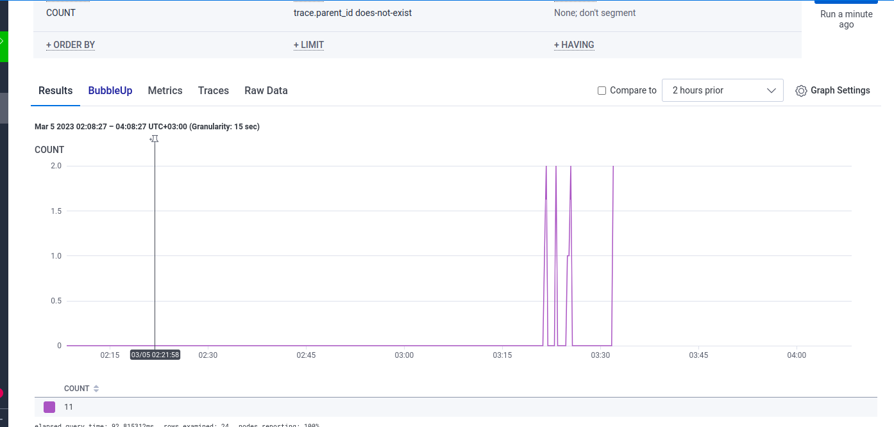
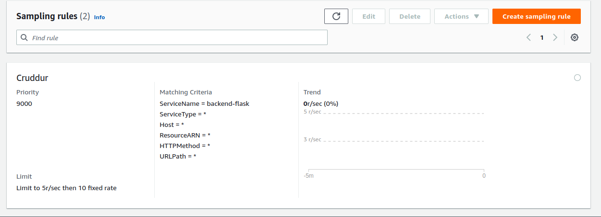
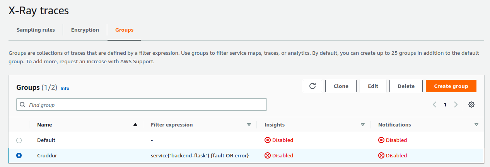
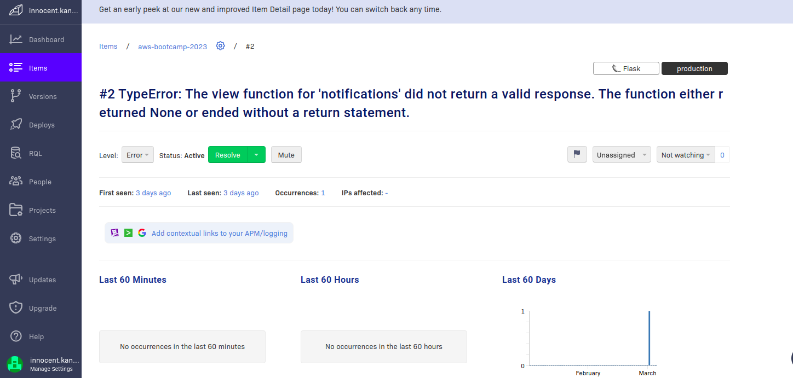
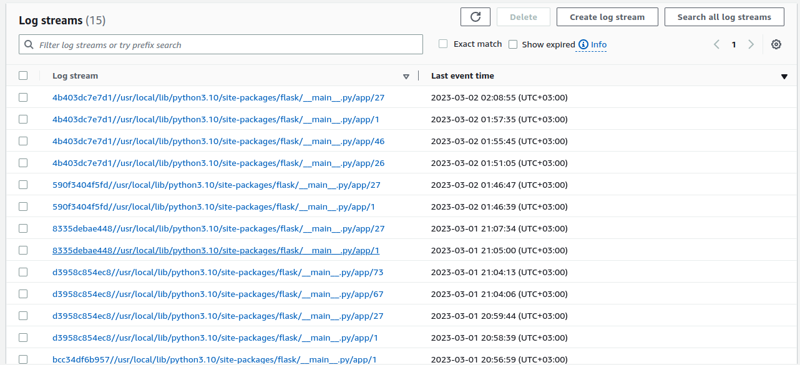
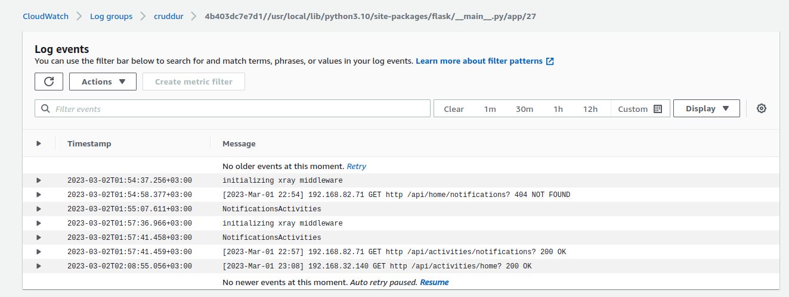
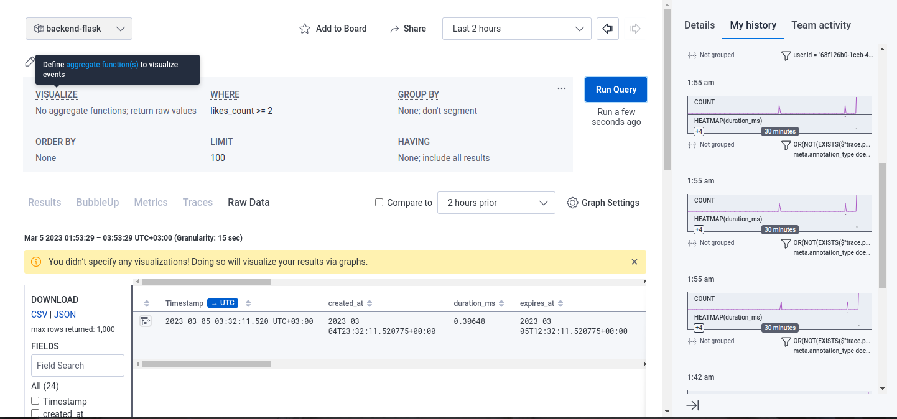

# Week 2 — Distributed Tracing
### Required Work
1- Instrument our backend flask application to use Open Telemetry (OTEL) with Honeycomb.io as the provider

I decided to implement OTEL using a collector for the backend to collect traces for all requests

```
mkkdir otel
touch otel-collector-config.yml

```
[otel-collector-config](https://github.com/innocentkagina/aws-bootcamp-cruddur-2023/blob/e4df33a9bbbabc84e58b0412ca58acea2d53a698/otel/otel-collector-config.yml)

install otel-collector-http in requirements file
```
pip install opentelemetry-exporter-otlp-proto-http
```
Add otel-collector-contrib docker image to docker-compose
-
[docker-compose](https://github.com/innocentkagina/aws-bootcamp-cruddur-2023/blob/e4df33a9bbbabc84e58b0412ca58acea2d53a698/docker-compose.yml)
 

Add OTEL libraries in backend. "I used http library"

[app.py](https://github.com/innocentkagina/aws-bootcamp-cruddur-2023/blob/e4df33a9bbbabc84e58b0412ca58acea2d53a698/backend-flask/app.py)
```
#HoneyComb to OTEL Collector
from opentelemetry import trace
from opentelemetry.exporter.otlp.proto.http.trace_exporter import OTLPSpanExporter
from opentelemetry.instrumentation.flask import FlaskInstrumentor

from opentelemetry.sdk.resources import SERVICE_NAME, Resource
from opentelemetry.sdk.trace import TracerProvider
from opentelemetry.sdk.trace.export import BatchSpanProcessor

# Service name is required for most backends
resource = Resource(attributes={
    SERVICE_NAME: "backend-flask"
})

provider = TracerProvider(resource=resource)
processor = BatchSpanProcessor(OTLPSpanExporter(endpoint="https://4318-innocentkag-awsbootcamp-ce2nnaqx0xi.ws-eu89.gitpod.io/v1/traces"))
provider.add_span_processor(processor)
trace.set_tracer_provider(provider)
tracer = trace.get_tracer(__name__)
```

Add Flask instrumentation to app function
```
FlaskInstrumentor().instrument_app(app)

```


2- Run queries to explore traces within Honeycomb.io

I run a query showing "Trace volume" in HoneyComb
 

3- Instrument AWS X-Ray into backend flask application

I added  a sampling xray json file to create sampling rule
[xray.json](https://github.com/innocentkagina/aws-bootcamp-cruddur-2023/blob/e4df33a9bbbabc84e58b0412ca58acea2d53a698/aws/json/xray.json)

Sampling Rule
 

I also created a sampling group
 

I added xray libraries to backend
[App file](https://github.com/innocentkagina/aws-bootcamp-cruddur-2023/blob/e4df33a9bbbabc84e58b0412ca58acea2d53a698/backend-flask/app.py)

```
# AWS X-Ray Libraries
from aws_xray_sdk.core import xray_recorder
from aws_xray_sdk.ext.flask.middleware import XRayMiddleware

xray_url = os.getenv("AWS_XRAY_URL")
xray_recorder.configure(service='backend-flask', dynamic_naming=xray_url)

# Initialize automatic instrumentation with Flask X-ray
XRayMiddleware(app, xray_recorder)
FlaskInstrumentor().instrument_app(app)
RequestsInstrumentor().instrument()

```


4- Configure and provision X-Ray daemon within docker-compose and send data back to X-Ray API

[docker-compose](https://github.com/innocentkagina/aws-bootcamp-cruddur-2023/blob/e4df33a9bbbabc84e58b0412ca58acea2d53a698/docker-compose.yml)
```
 xray-daemon:
      image: "amazon/aws-xray-daemon"
      environment:
        AWS_ACCESS_KEY_ID: "${AWS_ACCESS_KEY_ID}"
        AWS_SECRET_ACCESS_KEY: "${AWS_SECRET_ACCESS_KEY}"
        AWS_REGION: "${AWS_REGION}"
      command:
        - "xray -o -b xray-daemon:2000"
      ports:
        - 2000:2000/udp

```

5- Observe X-Ray traces within the AWS Console

```
```
 

6- Integrate Rollbar for Error Logging

```
# Rollbar Libraries
import rollbar
import rollbar.contrib.flask
from flask import got_request_exception
```


7- Trigger an error an observe an error with Rollbar

```
#Rollbar
@app.route('/rollbar/test')
def rollbar_test():
    rollbar.report_message('Hello World!', 'warning')
    return "Hello World!"
```
 

8- Install WatchTower and write a custom logger to send application log data to CloudWatch Log group

I added  logs for [messages services](https://github.com/innocentkagina/aws-bootcamp-cruddur-2023/blob/e4df33a9bbbabc84e58b0412ca58acea2d53a698/backend-flask/services/messages.py) and [notifications services](https://github.com/innocentkagina/aws-bootcamp-cruddur-2023/blob/e4df33a9bbbabc84e58b0412ca58acea2d53a698/backend-flask/services/notifications_activities.py) 
```
# Configuring Logger to Use CloudWatch
LOGGER = logging.getLogger(__name__)
LOGGER.setLevel(logging.DEBUG)
console_handler = logging.StreamHandler()
cw_handler = watchtower.CloudWatchLogHandler(log_group='cruddur')
LOGGER.addHandler(console_handler)
LOGGER.addHandler(cw_handler)

logger.info("Messages")

logger.info("NotificationsActivities")

```
 
 


### Home Work
1- Add custom instrumentation to Honeycomb to add more attributes eg. UserId, Add a custom span

I added custom instrumentation in [my notifications backend file](https://github.com/innocentkagina/aws-bootcamp-cruddur-2023/blob/e4df33a9bbbabc84e58b0412ca58acea2d53a698/backend-flask/services/notifications_activities.py) with more attributes like "uuid","handle" by looping through the results

```
span = trace.get_current_span()
      for item in results:
        for key, value in item.items():
           span.set_attribute(key, value)

```
 