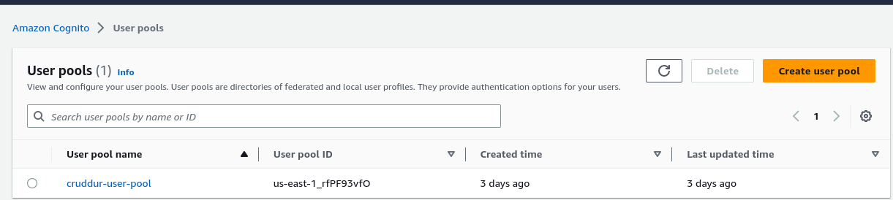
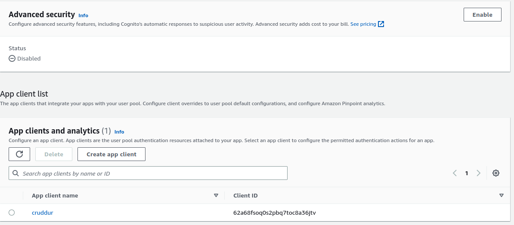

# Week 3 — Decentralized Authentication
### Required Work
1-Set Up Amazon Cognito User Pool

I managed to set up a cognito pool and application ID

 

App ID
 


2-Install and configure Amplify client-side library for Amazon Congito

[Package Json File](https://github.com/innocentkagina/aws-bootcamp-cruddur-2023/blob/89256ba0b662761fe7d69a6bd627879fcc489d93/frontend-react-js/package.json)

```
npm install aws-amplify 

```
Here i had to set up some environment variables to used by React

[App.js](https://github.com/innocentkagina/aws-bootcamp-cruddur-2023/blob/89256ba0b662761fe7d69a6bd627879fcc489d93/frontend-react-js/src/App.js)

[Docker Compose File](https://github.com/innocentkagina/aws-bootcamp-cruddur-2023/blob/89256ba0b662761fe7d69a6bd627879fcc489d93/docker-compose.yml)


3-Implement API calls to Amazon Coginto for custom login, signup, recovery and confirmation

login Page
[signin](https://github.com/innocentkagina/aws-bootcamp-cruddur-2023/blob/89256ba0b662761fe7d69a6bd627879fcc489d93/frontend-react-js/src/pages/SigninPage.js)

signup Page
[signup](https://github.com/innocentkagina/aws-bootcamp-cruddur-2023/blob/89256ba0b662761fe7d69a6bd627879fcc489d93/frontend-react-js/src/pages/SignupPage.js)

recovery page
[recovery](https://github.com/innocentkagina/aws-bootcamp-cruddur-2023/blob/89256ba0b662761fe7d69a6bd627879fcc489d93/frontend-react-js/src/pages/RecoverPage.js)

forgot password page
[confirmation](https://github.com/innocentkagina/aws-bootcamp-cruddur-2023/blob/89256ba0b662761fe7d69a6bd627879fcc489d93/frontend-react-js/src/pages/ConfirmationPage.js)


5- Verify JWT Token server side to serve authenticated API endpoints in Flask Application

[Cognito File JWT Token](https://github.com/innocentkagina/aws-bootcamp-cruddur-2023/blob/89256ba0b662761fe7d69a6bd627879fcc489d93/backend-flask/lib/cognito_jwt_token.py)

Implementation in app file

[App file ](https://github.com/innocentkagina/aws-bootcamp-cruddur-2023/blob/89256ba0b662761fe7d69a6bd627879fcc489d93/backend-flask/app.py)

```
# CognitoJwtToken
from lib.cognito_jwt_token import CognitoJwtToken, extract_access_token, TokenVerifyError

# CognitoJwtToken env
cognito_jwt_token = CognitoJwtToken(
  user_pool_id=os.getenv("AWS_COGNITO_USER_POOL_ID"), 
  user_pool_client_id=os.getenv("AWS_COGNITO_USER_POOL_CLIENT_ID"),
  region=os.getenv("AWS_DEFAULT_REGION")
)
```


