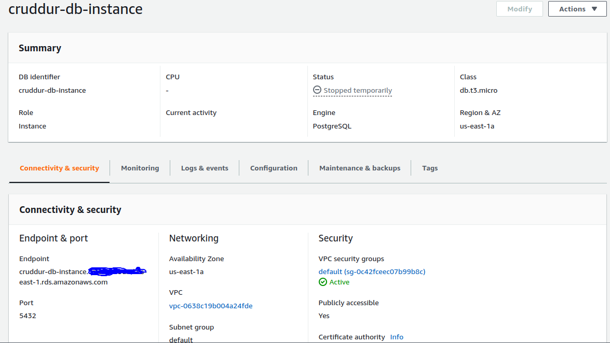
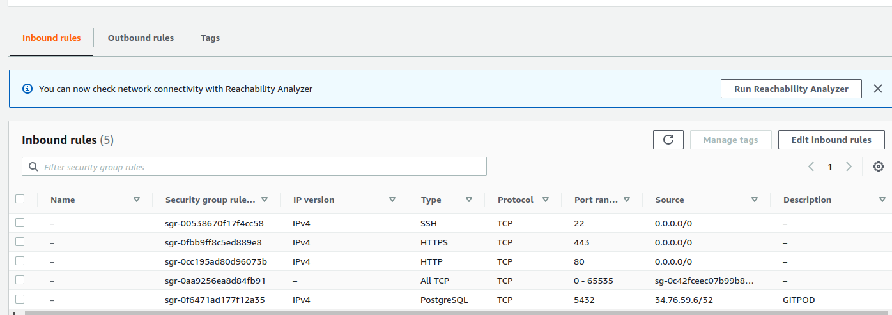
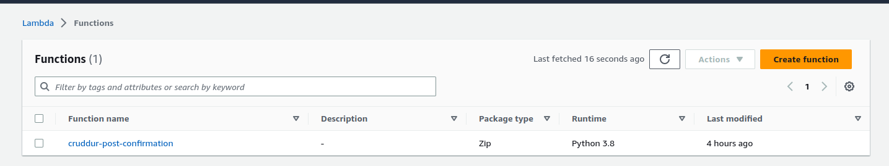
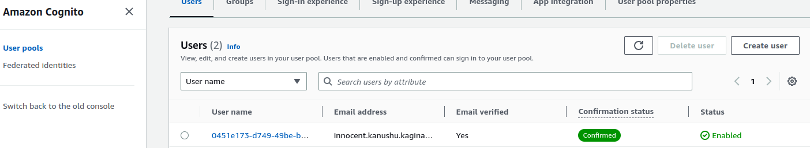
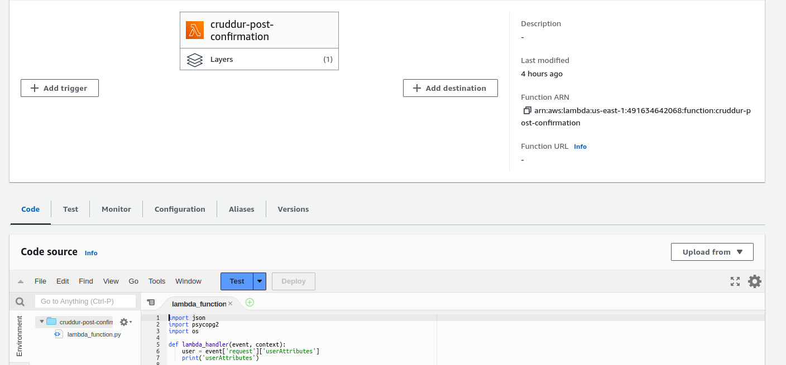
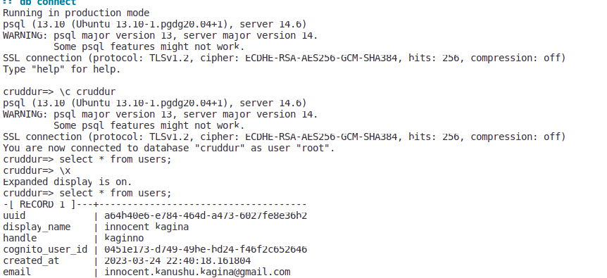
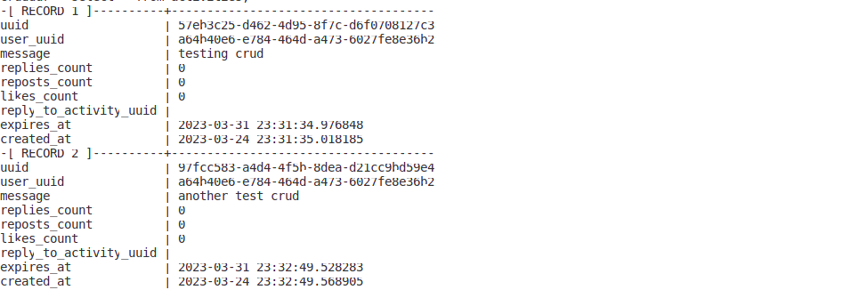
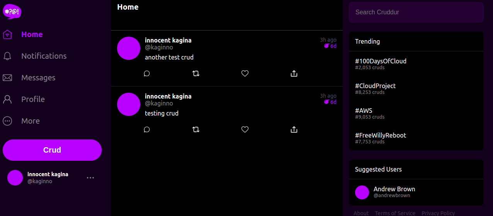

# Week 4 — Postgres and RDS

### Required Work
1- Provision an RDS instance

In this week we started off by creating an aws rds postgres relational database using the console

AWS-RDS Instance


2- Remotely connect to RDS instance

After we proceeded to connect to rds instance from an external source using constant variables by passing connection url into postgres container.


```
psql $CONNECTION_URL
```

Docker Compose File
[Docker-compose File](https://github.com/innocentkagina/aws-bootcamp-cruddur-2023/blob/318c5315074cb8a7cc945794f05edcef7307f52f/docker-compose.yml)


3- Programmatically update a security group rule

We added a security group rule to allow Gitpod to access the RDS database instance and automated with command in gitpod file

```
command: |
      export GITPOD_IP=$(curl ifconfig.me)
      source "$THEIA_WORKSPACE_ROOT/backend-flask/bin/rds-update-sg-rule"

```
Gitpod Yml
[Gitpod File](https://github.com/innocentkagina/aws-bootcamp-cruddur-2023/blob/318c5315074cb8a7cc945794f05edcef7307f52f/.gitpod.yml)

AWS Security Group Rules


4- Write several bash scripts for database operations

To speed up database operations,we created several bash scripts for easy.
There were some errors encoutered while running them especially if they affecting local db instance or aws RDS.

Bash Scripts
[Bash Folder](https://github.com/innocentkagina/aws-bootcamp-cruddur-2023/tree/main/backend-flask/bin)


5- Create a schema SQL file by hand

Schema
[Schema File](https://github.com/innocentkagina/aws-bootcamp-cruddur-2023/blob/318c5315074cb8a7cc945794f05edcef7307f52f/backend-flask/db/schema.sql)

6- Implement a Lambda that runs in a VPC and commits code to RDS

We first created a lambda function  that is triggered by cognito to send new request to AWS RDS instance when a user signs up

Lambda Name


Cognito User


Lambda Function Post Code
[Post Function](https://github.com/innocentkagina/aws-bootcamp-cruddur-2023/blob/318c5315074cb8a7cc945794f05edcef7307f52f/backend-flask/lambdas/cruddur-post-confirmation.py)



7- Operate common SQL commands
We ran some SQL commands to ensure database connection to AWS RDS is working

Select Users



Select Activities


8- Work with PSQL json functions to directly return json from the database

We had to create functions to aid our application making SQL statements to the AWS RDS database and returning results as json

Json Helpers
[Json Helpers](https://github.com/innocentkagina/aws-bootcamp-cruddur-2023/blob/318c5315074cb8a7cc945794f05edcef7307f52f/backend-flask/lib/db.py)

Crud Inputs


9- Implement a postgres client for python using a connection pool

Python Pool Connection
[Connection Pool for Python](https://github.com/innocentkagina/aws-bootcamp-cruddur-2023/blob/318c5315074cb8a7cc945794f05edcef7307f52f/backend-flask/lib/db.py)