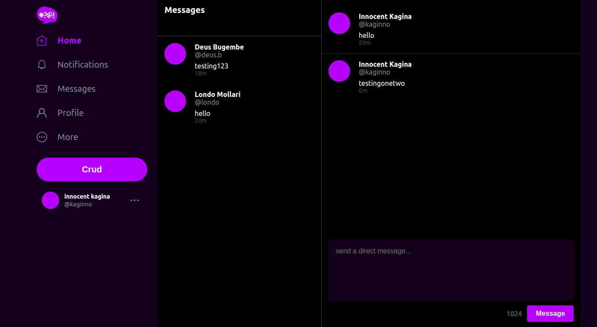
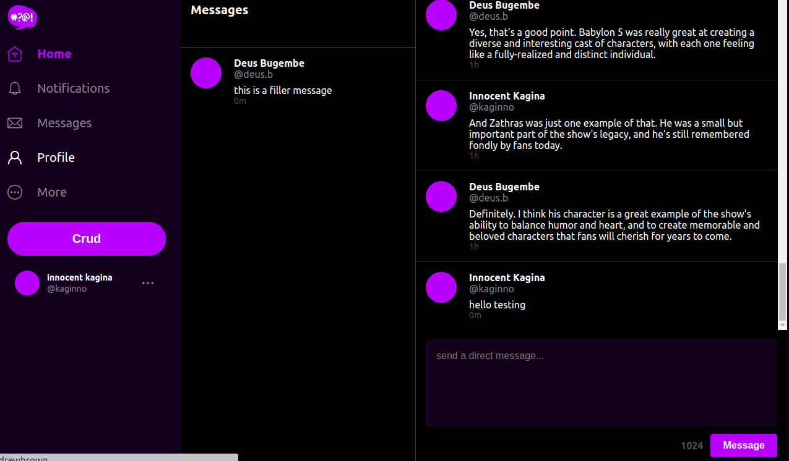
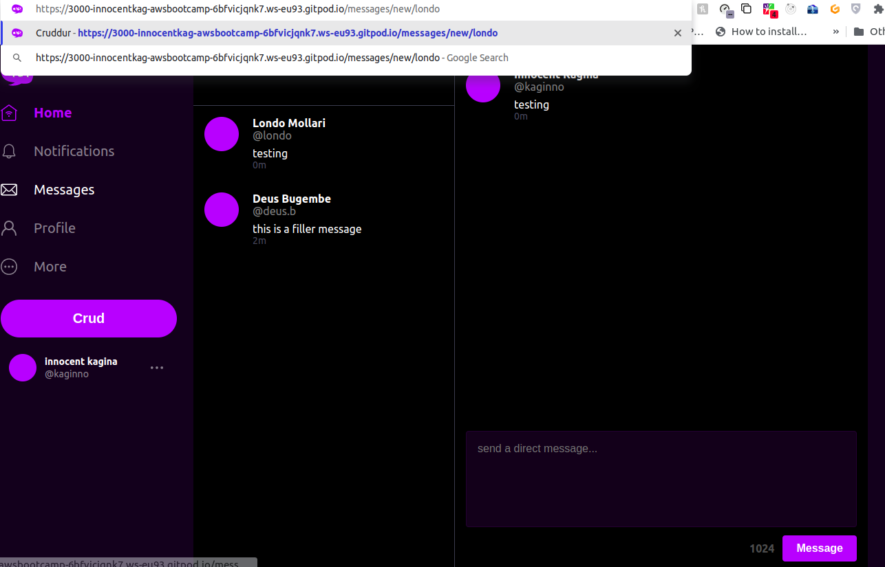
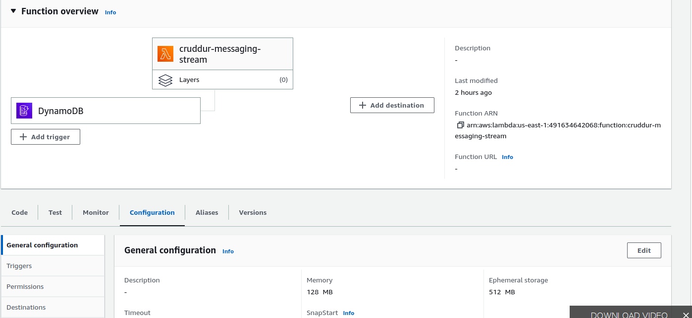
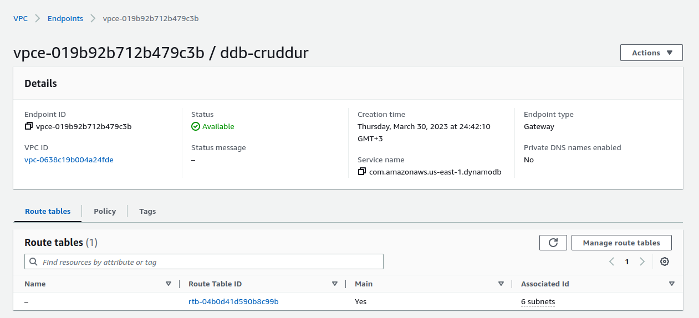
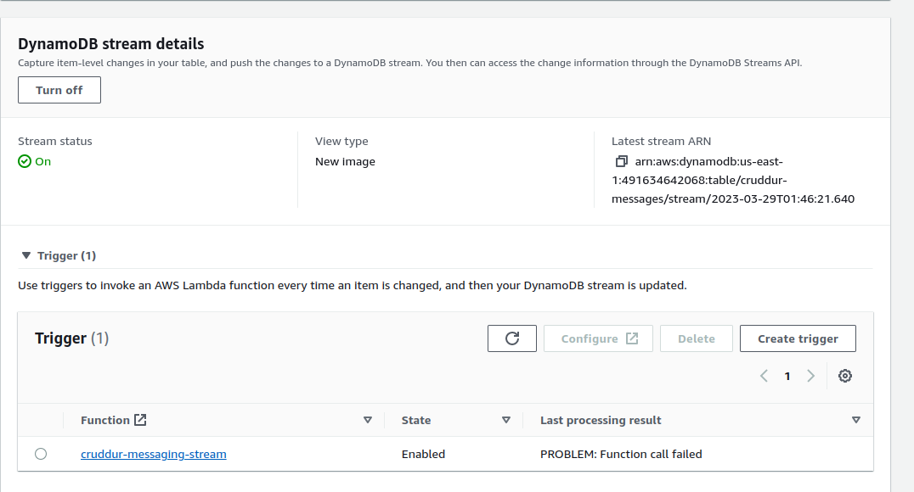
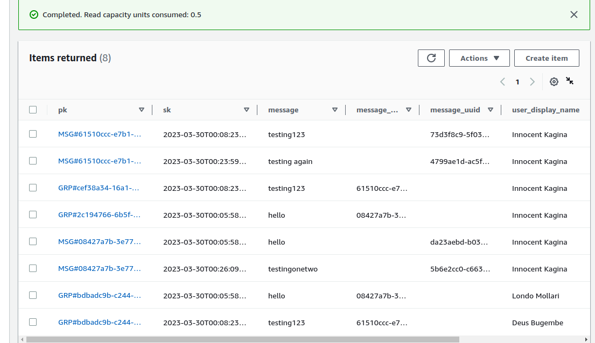
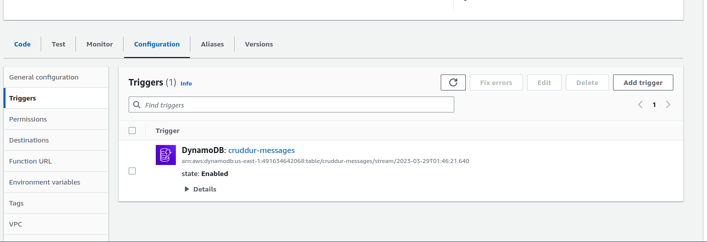

# Week 5 — DynamoDB and Serverless Caching

1- Implement Schema Load Script

In this week, we implemented dynamodb schema load scripts

[Schema Load File](https://github.com/innocentkagina/aws-bootcamp-cruddur-2023/blob/71237c1d4b09c5758447ae343f5622d3a80d76bc/backend-flask/bin/ddb/schema-load)

```
./backend-flask/bin/ddb/schema-load
```


2- Implement Seed Script

We also implemented dynamodb schema seed scripts

[Seed File](https://github.com/innocentkagina/aws-bootcamp-cruddur-2023/blob/71237c1d4b09c5758447ae343f5622d3a80d76bc/backend-flask/bin/ddb/seed)

```
./backend-flask/bin/ddb/seed
```


3- Implement Scan Script

We also implemented dynamodb schema scan scripts

[Scan File](https://github.com/innocentkagina/aws-bootcamp-cruddur-2023/blob/71237c1d4b09c5758447ae343f5622d3a80d76bc/backend-flask/bin/ddb/scan)

```
./backend-flask/bin/ddb/scan
```


4- Implement Pattern Scripts for Read and List Conversations

Read Conversations
[Read Conversations](https://github.com/innocentkagina/aws-bootcamp-cruddur-2023/blob/71237c1d4b09c5758447ae343f5622d3a80d76bc/backend-flask/bin/ddb/patterns/get-conversation)

```
./backend-flask/bin/ddb/patterns/get-conversation
```


List Conversations
[List Conversations](https://github.com/innocentkagina/aws-bootcamp-cruddur-2023/blob/71237c1d4b09c5758447ae343f5622d3a80d76bc/backend-flask/bin/ddb/patterns/list-conversations)

```
./backend-flask/bin/ddb/patterns/list-conversations
```


5- Implement Update Cognito ID Script for Postgres Database

[Update cognito ID Script](https://github.com/innocentkagina/aws-bootcamp-cruddur-2023/blob/71237c1d4b09c5758447ae343f5622d3a80d76bc/backend-flask/bin/update-cognito-user-ids)

```
./backend-flask/bin/update-cognito-user-ids

```


6- Implement (Pattern A) Listing Messages in Message Group into Application



7- Implement (Pattern B) Listing Messages Group into Application


8- Implement (Pattern C) Creating a Message for an existing Message Group into Application




9- Implement (Pattern D) Creating a Message for a new Message Group into Application



10-Implement (Pattern E) Updating a Message Group using DynamoDB Streams

 a) Create Lambda Function



 b) Create VPC End Point for dynamodb



 c) Create Dynamodb Stream

DynamoDb Streams




d) Create Trigger for dynamodb


